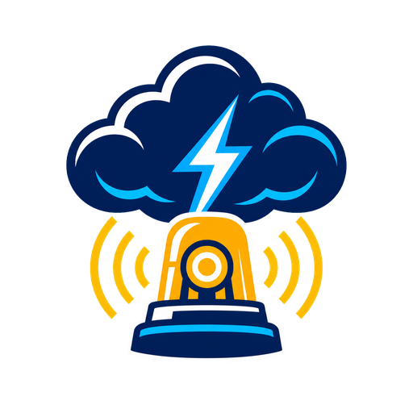

# NWS Weather Signal

<p align="center">
  <a href="https://github.com/bditter/nws-weather-signal/releases/latest"></a>
  <a href="https://github.com/bditter/nws-weather-signal/actions/workflows/validate.yml"></a>
  <a href="https://github.com/bditter/nws-weather-signal/actions/workflows/hassfest.yml"></a>
  <a href="https://hacs.xyz/"></a>
  <a href="LICENSE"></a>
</p>

<p align="center">
  
</p>

NWS Weather Signal is a Home Assistant custom integration that turns active
U.S. National Weather Service alerts into simple, automation-friendly binary
sensors.

Instead of placing every alert inside one large list attribute, the integration
creates a fixed number of alert slots. Each slot is `on` while it contains an
active alert and `off` when empty.

## Highlights

- Choose 1 to 10 alert slots; the default is 2.
- Configure alerts by coordinates, NWS forecast zone/county, or state/area.
- The most consequential alerts occupy the first slots.
- Each active slot exposes direct attributes for:
  - NWS and SAME event codes
  - title, event, description, and instructions
  - severity, urgency, and certainty
  - effective, onset, expiration, and ending times
  - affected area, zones, sender, alert ID, and source URL
- Polls weather.gov once per minute through one shared coordinator.
- Configured entirely from the Home Assistant user interface.

## Installation

### HACS custom repository

1. Open HACS.
2. Add `https://github.com/bditter/nws-weather-signal` as a custom integration
   repository.
3. Download **NWS Weather Signal**.
4. Restart Home Assistant.

### Manual

Copy `custom_components/nws_weather_signal` into the `custom_components`
directory in your Home Assistant configuration, then restart Home Assistant.

## Configuration

In Home Assistant, open **Settings > Devices & services > Add integration** and
search for **NWS Weather Signal**.

Choose one lookup method:

- **Coordinates** uses a latitude and longitude. Your Home Assistant location
  is supplied as the initial value.
- **NWS zone or county** accepts codes such as `INZ009` or `INC033`.
- **State or marine area** accepts a two-letter code such as `IN` or `GM`.

Choose how many alert slots to create. This can be changed later from the
integration's options.

## Entity behavior

The integration creates entities such as:

```text
binary_sensor.nws_weather_signal_alert_1
binary_sensor.nws_weather_signal_alert_2
```

Slot 1 receives the highest-priority active alert. Ordering considers severity,
urgency, certainty, and issue time. When fewer alerts exist than configured
slots, the remaining entities stay `off` and retain only their slot number.

Example automation:

```yaml
automation:
  - alias: Announce highest-priority NWS alert
    triggers:
      - trigger: state
        entity_id: binary_sensor.nws_weather_signal_alert_1
        to: "on"
    actions:
      - action: notify.notify
        data:
          title: >-
            {{ state_attr('binary_sensor.nws_weather_signal_alert_1', 'title') }}
          message: >-
            {{ state_attr('binary_sensor.nws_weather_signal_alert_1', 'description') }}
```

## Data source and safety

Alert data comes from the public
[weather.gov API](https://www.weather.gov/documentation/services-web-api).
NWS Weather Signal is not affiliated with or endorsed by NOAA or the National
Weather Service.

Do not rely on Home Assistant as your only way to receive emergency
information. Keep Wireless Emergency Alerts, NOAA Weather Radio, and local
official warning channels enabled.

## Original implementation

This project is an original, clean-room implementation based on public NOAA API
documentation and Home Assistant developer documentation. It does not contain
code, documentation, branding, or artwork copied from other NWS alert
integrations.

## License

[MIT](LICENSE)
